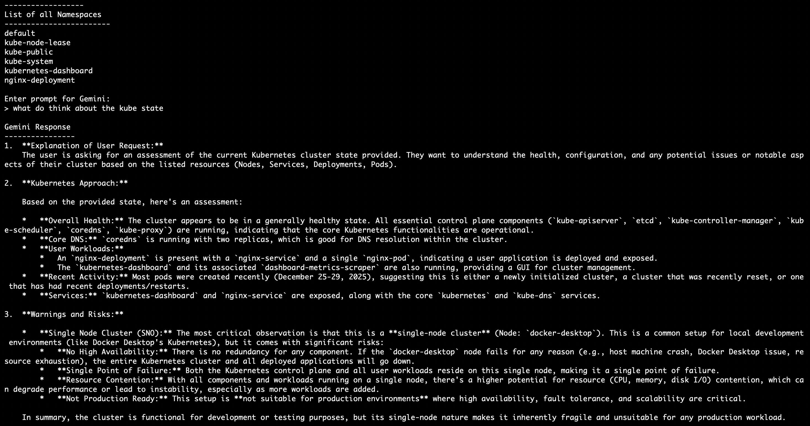

# AI-Powered Kubernetes Practice (Python + Gemini)

  

This repository is a **hands-on Kubernetes practice environment** combined with a **Python-based AI assistant** powered by **Google Gemini**.  
It is designed for **learning, experimenting, and understanding Kubernetes internals** while interacting through **natural language prompts**.

---

## Purpose of This Repository

- Practice **core Kubernetes concepts**
- Learn **Kubernetes Python client**
- Build a **CLI-based AI Kubernetes assistant**
- Use **Google Gemini** to:
  - Analyze cluster state
  - Explain Kubernetes behavior
  - Suggest deployments (HTTP / nginx / httpd)
  - Inspect pods, services, events, and logs
- Prepare for **real-world DevOps / SRE / OpenShift workflows**

---

## What This Project Does

✔ Detects cluster type (Single Node / Multi Node)  
✔ Lists Nodes, Namespaces, Pods, Services, Deployments, Events  
✔ Segregates **system vs user workloads**  
✔ Captures **pod creation timestamps**  
✔ Sends **live cluster state to Gemini**  
✔ Accepts **runtime prompts** like:

